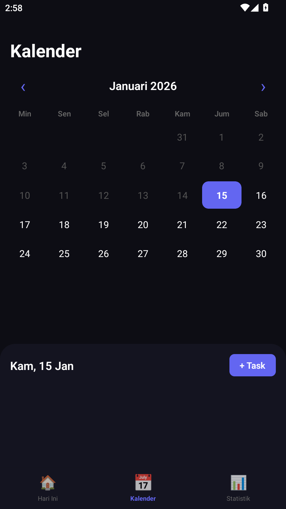
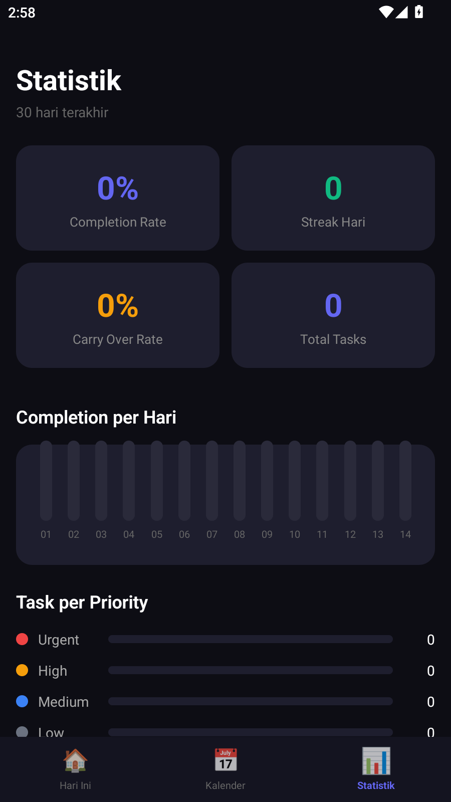
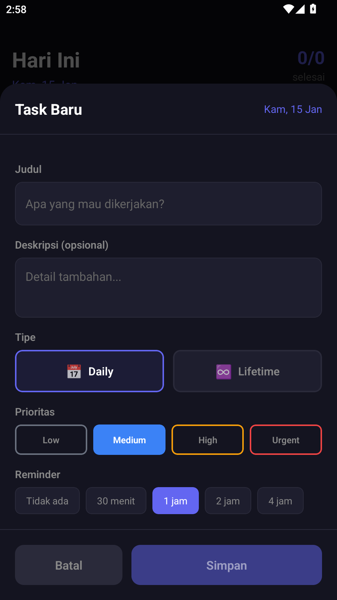

# 📋 Task Reminder

Aplikasi manajemen tugas harian dengan fitur reminder otomatis. Dibuat dengan React Native + Expo.

## ✨ Fitur Utama

- **📅 Daily Tasks** - Tugas harian yang akan di-carry over otomatis jika belum selesai
- **♾️ Lifetime Tasks** - Tugas jangka panjang yang selalu muncul sampai selesai
- **🔔 Smart Reminder** - Notifikasi pengingat dengan interval yang bisa diatur
- **📊 Statistik** - Pantau produktivitas kamu dengan grafik mingguan
- **📆 Kalender View** - Lihat dan kelola tugas berdasarkan tanggal
- **🔄 Auto Update** - Notifikasi otomatis saat ada versi baru

## 📱 Screenshots

| Home | Kalender | Statistik | Add Task |
|:---:|:---:|:---:|:---:|
|  |  |  |  |

## 🚀 Download

Ambil versi terbaru di halaman [Releases](https://github.com/SUSUSAPISEGAR/taskreminder/releases).

## 🛠️ Tech Stack

- React Native
- Expo
- TypeScript
- AsyncStorage
- Expo Notifications

## 📦 Instalasi Development

```bash
# Clone repo
git clone https://github.com/SUSUSAPISEGAR/taskreminder.git
cd taskreminder

# Install dependencies
npm install

# Jalankan di Android
npx expo run:android
```

## 🔧 Build APK

```bash
cd android
./gradlew assembleRelease
```

APK akan tersedia di `android/app/build/outputs/apk/release/app-release.apk`

## 📝 Lisensi

MIT License - Bebas digunakan untuk keperluan pribadi dan komersial.

---

Made with ❤️ by SUSUSAPISEGAR
